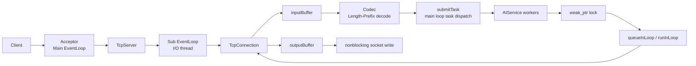

# MyRPCProject

MyRPCProject 是一个 C++17 实现的单机 RPC / 网络通信框架原型，用来验证 Reactor 网络模型、Length-Prefix 分帧、异步业务执行和跨线程安全回写链路。

它不是生产级 RPC 框架，也不是完整 Agent Runtime。当前重点是网络通信底座和线程模型，不包含完整服务治理能力。

## 已实现能力

- Main-Sub Reactor 和 one loop per thread。
- `EventLoop`、`Channel`、`Poller`、`EpollPoller`、`PollPoller`。
- Linux 下使用 `epoll` ET；macOS / 非 Linux 环境回退到 `poll`。
- `TcpServer`、`Acceptor`、`TcpConnection`。
- 非阻塞 socket 读写；Linux 读写路径循环处理到 `EAGAIN`。
- Length-Prefix 分帧协议：`[4-byte bodyLen][body]`。
- `Buffer` 和 `Codec` 处理 TCP 粘包、半包。
- 通过 `AIService` / `TaskCoordinator` 模拟长耗时业务任务。
- worker 完成后通过 `weak_ptr` 判断连接是否仍然存在，再投递回连接所属 `EventLoop`。
- `outputBuffer` 处理非阻塞写不完的数据。
- 基础定时器、空闲连接清理、信号触发优雅退出、Prometheus 风格文本指标日志。
- Docker Linux 环境验证，以及 Python e2e / benchmark 脚本。

## 当前边界

当前还没有实现：

- 完整 RPC header。
- `request_id`、`method`、`status`、`trace_id`。
- 请求级 timeout。
- 客户端 stub。
- 服务注册发现。
- 负载均衡。
- 鉴权。
- 限流熔断。
- 完整监控告警和链路追踪。
- 单连接多并发请求的乱序响应匹配。

当前协议能从 TCP 字节流里拆出多个完整帧，但它仍然只是分帧协议，不是完整 RPC 协议。

## 架构图



主请求链路：

```text
accept
  -> assign Sub EventLoop
  -> read
  -> inputBuffer
  -> Codec decode
  -> AIService worker
  -> weak_ptr lock
  -> queueInLoop / runInLoop
  -> sendInLoop
  -> outputBuffer
  -> handleWrite
```

更详细的组件说明见 [docs/architecture.md](docs/architecture.md)。

## 协议格式

每个消息帧格式：

```text
[4-byte bodyLen in network byte order][body bytes]
```

`Codec::decode()` 会先判断 4 字节长度头是否完整，再判断 body 是否完整。只有完整帧到达后才向上回调；不完整的数据继续保留在 `inputBuffer` 中等待后续读取。

## 构建运行

```bash
cmake -B build -DCMAKE_BUILD_TYPE=Release
cmake --build build -j
```

本地运行：

```bash
./build/rpc_demo 4
```

参数 `4` 表示 Sub Reactor I/O 线程数。默认监听地址是 `0.0.0.0:12345`。

macOS 本机构建会使用 `PollPoller`。如果要验证 Linux `EpollPoller` / ET 路径，建议使用 Docker。

## Docker 验证 Linux epoll

```bash
docker build -t myrpc-epoll .
docker run --rm -p 12345:12345 myrpc-epoll
```

Docker 默认启动：

```bash
./build/rpc_demo 4
```

如果默认基础镜像拉取困难，可以切换到 Docker Hub：

```bash
docker build --build-arg BASE_IMAGE=ubuntu:22.04 -t myrpc-epoll .
```

## E2E 测试

启动服务后运行：

```bash
python3 scripts/rpc_e2e_client.py --host 127.0.0.1 --port 12345 --body test
```

预期响应形态：

```text
AI: Intent(test) | Reasoning(test)
```

Docker 一键验收：

```bash
bash ./scripts/acceptance.sh myrpc-epoll myrpc-e2e 12345
```

脚本会启动容器、执行容器内 e2e、执行宿主机 e2e、做一次短时 benchmark，然后停止容器。远程沙箱环境下，宿主机侧 `127.0.0.1` 可能不是 Docker 宿主机，因此宿主机 e2e 失败有可能是环境假阳性。

## Benchmark 说明

当前 `scripts/bench.py` 跑的是 AI 模拟链路：

```bash
python3 scripts/bench.py --host 127.0.0.1 --port 12345 --concurrency 5 --duration 2 --timeout 20
```

这条链路包含模拟业务耗时，所以 QPS 和延迟主要反映 AI 任务路径，不代表网络栈极限性能。

如果讨论网络层 echo benchmark，需要带上窄口径：

```text
单机 echo benchmark，包体约 128B，不访问 DB / Redis / 磁盘，
主要验证 Reactor 事件分发、Length-Prefix 拆包、线程投递和异步回写。
QPS 约 1.2w-1.5w，P95 < 10ms。
这个数据不代表真实业务链路或生产级压测。
```

不要把 echo benchmark 指标和 AI 长耗时任务链路混用。

## 目录结构

```text
include/              头文件
src/                  C++ 实现
scripts/              Python e2e 和 benchmark 脚本
docs/                 架构和验证说明
CMakeLists.txt        CMake 构建定义
Dockerfile            Linux epoll 验证环境
```

## 设计要点

- `TcpConnection` 绑定固定 `EventLoop`。
- `EventLoop` 绑定固定线程。
- worker 线程不能直接写 socket。
- 跨线程回写必须投递回连接所属 loop。
- `pendingFunctors_` 使用 mutex 保护，并在执行前 swap 到局部 vector；不是 lock-free 队列。
- Linux `epoll` ET 下，socket 和 wakeup pipe 都要处理到 `EAGAIN`。
