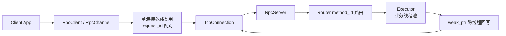

# MyRPCProject

MyRPCProject 是一个 C++17 实现的 RPC / 网络通信框架，用来验证 Reactor 网络模型、单连接多路复用、异步业务执行和跨线程安全回写链路。V2.0 已把 V1 的「Length-Prefix 分帧原型」升级为带完整 RPC 语义的协议（request_id / method / status / 超时），并提供了 C++ 客户端 stub。

它不是生产级 RPC 框架，也不是完整 Agent Runtime。V2.1（服务治理）与 V2.2（性能/可观测）尚未实现。

## 已实现能力

**V1 底座（Reactor 网络层）**

- Main-Sub Reactor 和 one loop per thread。
- `EventLoop`、`Channel`、`Poller`、`EpollPoller`、`PollPoller`。
- Linux 下使用 `epoll` ET；macOS / 非 Linux 环境回退到 `poll`。
- 非阻塞 socket 读写；Linux 读写路径循环处理到 `EAGAIN`。
- 非阻塞写 `outputBuffer`、定时器、空闲连接清理、信号触发优雅退出、Prometheus 风格文本指标日志。

**V2.0（协议与 RPC 语义闭环）**

- 24 字节定长协议头：`magic / version / flags / msg_type / status / request_id / method_id / timeout_ms / body_len / reserved`。
- 自研 tag-based 二进制序列化（`Serializer`）：动态 `Value` 类型、字段号演进兼容、未知字段安全解码、`toJson` 调试视图，零第三方依赖。
- 服务端 `RpcServer`：`Router` 方法路由、服务端 deadline 判定（处理超时回 `DEADLINE_EXCEEDED`）、心跳应答、状态码体系。
- C++ 客户端 stub：`RpcClient` / `RpcChannel` / `RpcController`。
  - 单连接多路复用：并发请求按 `request_id` 配对，乱序响应正确路由（O(1) 查找），迟到响应丢弃。
  - 同步 `call()` 与异步 `callAsync()` 两套 API。
  - 客户端 deadline：超时回 `DEADLINE_EXCEEDED`，超时后连接仍可复用。
  - 应用层心跳：空闲 5s 发心跳，连续 2 次无 ack 判死（周期 < 服务端 30s 空闲清理阈值）。
- Python e2e 客户端（单请求 / 并发乱序 / 超时 / 心跳四种模式）与 benchmark 脚本。

## 当前边界

当前还没有实现（V2.1 / V2.2 规划）：

- 服务注册发现、负载均衡、熔断、限流、重试策略。
- 请求级超时已实现（V2.0），但服务端无过载保护（max_concurrency）。
- M:N 协程调度、零拷贝、outputBuffer 高水位背压。
- trace_id 链路追踪、histogram 指标、`/metrics` HTTP endpoint。
- 真实任务队列深度（`pendingTaskSize()` 仍返回 0）。
- TLS / 鉴权。

## 架构图


```mermaid
flowchart LR
    ClientApp[Client App] --> Stub[RpcClient / RpcChannel]
    Stub --> Multi[单连接多路复用<br/>request_id 配对]
    Multi --> Conn[TcpConnection]
    Conn --> Server[RpcServer]
    Server --> Router[Router method_id 路由]
    Router --> Exec[Executor<br/>业务线程池]
    Exec --> WB[weak_ptr 跨线程回写]
    WB --> Conn
```

主请求链路：

```text
client call()
  -> RpcChannel request_id 分配
  -> 24B header + Serializer body
  -> TcpConnection
  -> RpcServer 拆帧 / 路由 / deadline
  -> handler（异步）
  -> weak_ptr lock -> queueInLoop
  -> 响应按 request_id 回客户端
```

更详细的组件说明见 `docs/architecture.md`。

## 协议格式

每个消息帧格式（24 字节定长头，网络字节序）：

```text
[0-1]  magic "MP"      [2] version=1       [3] flags
[4]    msg_type         [5-6] status       [7-10] request_id
[11-14] method_id      [15-18] timeout_ms  [19-22] body_len
[23]   reserved
[body bytes]
```

- `msg_type`：0=请求 1=响应 2=oneway 3=心跳 4=心跳响应。
- `body_len` 语义 = 序列化 body 字节数，不含 24B 头（半包保留在缓冲、粘包一次拆多帧）。
- 业务 body 用 `Serializer` 编码（tag-based、字段号演进兼容）。

## 构建运行

```bash
cmake -B build -DCMAKE_BUILD_TYPE=Release
cmake --build build -j
```

启动服务端：

```bash
./build/rpc_demo 4
```

参数 `4` 表示 Sub Reactor I/O 线程数。默认监听 `0.0.0.0:12345`，注册了两个方法：

- `demo.echo`：回显请求体（快速链路）。
- `demo.ai`：模拟长耗时 AI 任务（约 250ms，异步执行链路）。

运行 C++ 客户端 demo（并发多路复用 + 超时验证）：

```bash
./build/rpc_client_demo 100
```

macOS 本机构建使用 `PollPoller`。Linux `EpollPoller` / ET 路径建议用 Docker 验证（见下）。

## Docker 验证 Linux epoll

```bash
docker build --no-cache -t myrpc-epoll .
docker run --rm -p 12345:12345 myrpc-epoll
```

一键验收（容器内 e2e + 宿主机 e2e + 短时 benchmark）：

```bash
bash ./scripts/acceptance.sh myrpc-epoll myrpc-e2e 12345
```

## E2E 测试

启动服务端后：

```bash
# 单请求（demo.echo）
python3 scripts/rpc_e2e_client.py --host 127.0.0.1 --port 12345 --method demo.echo --body test

# AI 链路
python3 scripts/rpc_e2e_client.py --method demo.ai --body test

# 并发乱序验证（单连接 50 个请求按 request_id 配对）
python3 scripts/rpc_e2e_client.py --concurrency 50

# 服务端超时验证（ai 约 250ms，timeout 100ms 应回 DEADLINE_EXCEEDED）
python3 scripts/rpc_e2e_client.py --method demo.ai --timeout-ms 100

# 心跳验证
python3 scripts/rpc_e2e_client.py --heartbeat 5
```

## Benchmark 说明

`scripts/bench.py` 默认跑 AI 模拟链路（`--method demo.ai`），包含模拟业务耗时，QPS/延迟主要反映 AI 任务路径，不代表网络栈极限：

```bash
python3 scripts/bench.py --host 127.0.0.1 --port 12345 --concurrency 5 --duration 3 --timeout 20
```

网络层口径可用 echo 链路单独验证：

```bash
python3 scripts/bench.py --method demo.echo --expect-prefix hello- --concurrency 50 --duration 3 --timeout 20
```

不要把 AI 长耗时链路指标和网络层指标混用。

## 目录结构

```text
include/              头文件
src/                  实现（含 rpc_client_demo 客户端示例）
scripts/              Python e2e / benchmark 脚本
docs/                 架构说明（architecture.md）
CMakeLists.txt        CMake 构建定义
Dockerfile            Linux epoll 验证环境
```

## 设计要点

- `TcpConnection` 绑定固定 `EventLoop`，`EventLoop` 绑定固定线程；worker 线程不能直接写 socket，跨线程回写必须投递回连接所属 loop。
- `RpcChannel` 在独立 `EventLoop` 线程上跑连接，多路复用靠 `request_id` + 槽位表 O(1) 路由；`RpcController` 生命周期由调用方保证，完成时由 channel 更新其状态。
- 超时是单一 deadline 语义：客户端到点结束且不重试；服务端处理超时回 `DEADLINE_EXCEEDED`；迟到响应按 `request_id` 丢弃。
- `pendingFunctors_` 使用 mutex 保护，执行前 swap 到局部 vector。
- Linux `epoll` ET 下，socket 和 wakeup pipe 都要处理到 `EAGAIN`。
- 纯自研零第三方依赖：协议、序列化、客户端/服务端全部手写。
