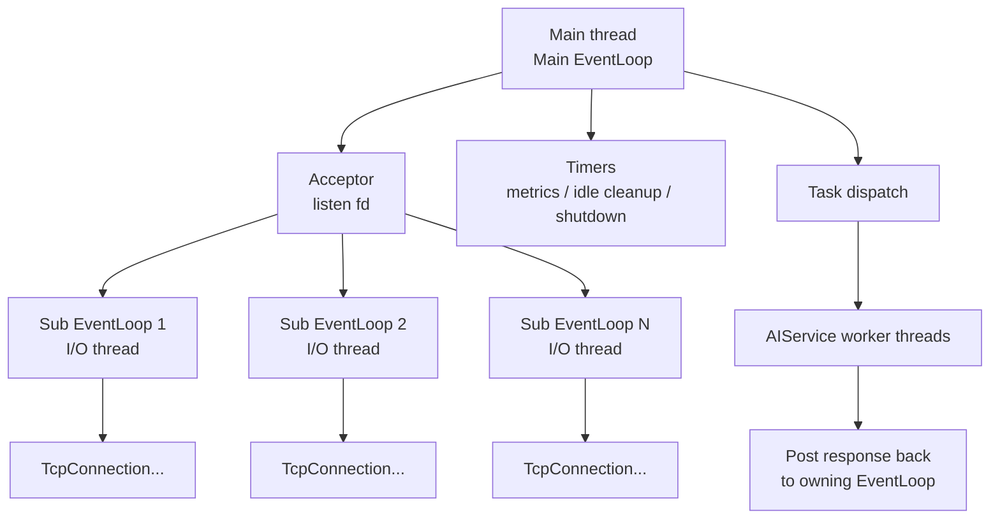

# 架构说明

MyRPCProject 是一个 C++17 单机 RPC / 网络通信框架原型。项目范围聚焦在网络事件分发、协议分帧、异步业务执行和跨线程安全回写。

它不是生产级 RPC 框架。

## 组件概览

| 组件 | 职责 |
| --- | --- |
| `EventLoop` | 绑定一个事件循环线程，负责 active channel 分发、定时器和 pending functors。 |
| `Channel` | 封装 fd 关注事件和 readable / writable / close / error 回调。 |
| `Poller` | I/O 多路复用抽象接口。 |
| `EpollPoller` | Linux `epoll` 实现，使用 ET 边缘触发。 |
| `PollPoller` | macOS / 非 Linux 环境下的 `poll` 实现。 |
| `Acceptor` | 管理 listen socket，接受新 TCP 连接。 |
| `TcpServer` | 创建 `TcpConnection`、分配 Sub EventLoop、维护连接容器、处理空闲连接清理。 |
| `TcpConnection` | 管理连接 fd、`Channel`、input/output buffer、连接状态和回调。 |
| `Buffer` | 保存未解析完的输入数据，以及非阻塞写未写完的输出数据。 |
| `Codec` | 编解码 `[4-byte bodyLen][body]` 消息帧。 |
| `ThreadPool` | 管理 Sub EventLoop 线程，并通过轮询方式分配连接。 |
| `AIService` | 使用 worker 线程执行模拟业务任务。 |
| `TaskCoordinator` | 模拟 Intent 和 Reasoning 子任务组合。 |
| `Metrics` | 记录基础计数、延迟桶，并输出 Prometheus 风格文本日志。 |

## 线程模型



关键约束：

- 一个 `TcpConnection` 绑定一个固定 `EventLoop`。
- 一个 `EventLoop` 绑定一个固定线程。
- fd、`Channel`、`inputBuffer`、`outputBuffer` 相关操作应回到所属 I/O loop 执行。
- worker 线程不能直接写 socket。

## 请求链路

```text
Client connects
  -> Acceptor 在 Main EventLoop 中 accept connfd
  -> TcpServer 选择一个 Sub EventLoop
  -> 创建 TcpConnection，并投递到该 Sub EventLoop 注册 Channel
  -> Sub EventLoop 收到可读事件
  -> TcpConnection::handleRead 读取字节到 inputBuffer
  -> Codec::decode 解析完整 Length-Prefix 帧
  -> message callback 提交业务任务
  -> AIService worker 执行模拟任务
  -> 完成回调 weak_ptr.lock()
  -> TcpConnection::sendMessage()
  -> runInLoop / queueInLoop 投递回所属 EventLoop
  -> sendInLoop 尝试非阻塞写
  -> 未写完的数据进入 outputBuffer
  -> handleWrite 在可写事件中继续发送
```

## Length-Prefix 分帧

当前帧格式：

```text
[4-byte bodyLen in network byte order][body bytes]
```

这只是分帧协议，用于解决 TCP 粘包和半包。它还不提供完整 RPC 语义，例如 `request_id`、方法路由、状态码、trace、请求超时等。

## EventLoop 唤醒

跨线程调用 `queueInLoop()` 时，会向 wakeup pipe 写入一个字节，用来唤醒可能阻塞在 `poll` / `epoll_wait` 中的 `EventLoop`，使其尽快执行 pending functors。

Linux 下 wakeup pipe 两端设置为非阻塞。由于 `EpollPoller` 使用 ET，wakeup 读侧会循环读取直到 `EAGAIN`，这和 socket 读写路径的 ET 处理规则一致。

`pendingFunctors_` 使用 mutex 保护。`doPendingFunctors()` 会先把待执行回调 swap 到局部 vector，再在不持锁的情况下执行，以缩短锁持有时间，并避免阻塞其他线程继续投递任务。

## 当前 RPC 边界

已实现：

- TCP 服务端和连接生命周期。
- Reactor 事件分发。
- Linux epoll ET 和 macOS poll fallback。
- Length-Prefix 分帧。
- 异步业务执行和回写。
- 非阻塞写的 outputBuffer。
- 基础指标、定时器、空闲连接清理和优雅退出。

未实现：

- 完整 RPC header。
- `request_id`。
- `method`。
- `status` / `error_code`。
- `trace_id`。
- 请求级 timeout。
- 客户端 stub。
- 注册发现。
- 负载均衡。
- 鉴权。
- 限流熔断。
- 完整监控告警。
- 乱序响应匹配。
