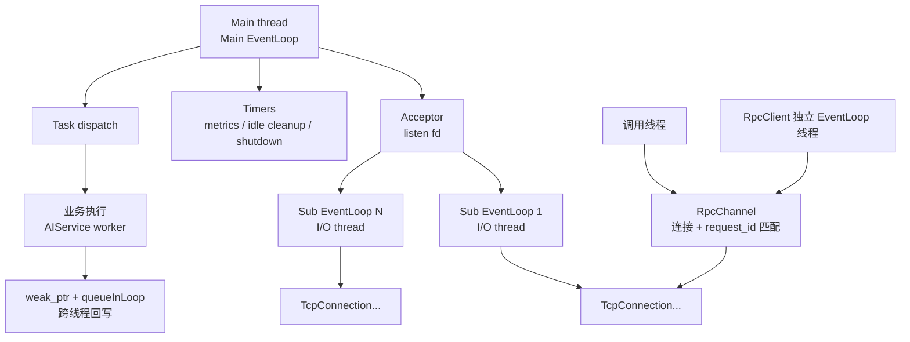

# 架构说明

MyRPCProject 是一个 C++17 单机 RPC / 网络通信框架。V1 完成 Reactor 网络底座；V2.0 补齐 RPC 语义（24B 协议头、自研序列化、服务端路由与超时、C++ 客户端 stub、单连接多路复用、心跳）；V2.1 增加服务治理（服务端限流与优雅关闭、多实例负载均衡、熔断、重试、注册发现）。

它不是生产级 RPC 框架。V2.2（性能 / 可观测）尚未实现。

## 组件概览

**V1 底座（Reactor 网络层）**

| 组件 | 职责 |
| --- | --- |
| `EventLoop` | 绑定一个事件循环线程，负责 active channel 分发、定时器和 pending functors。 |
| `Channel` | 封装 fd 关注事件和 readable / writable / close / error 回调。 |
| `Poller` | I/O 多路复用抽象接口。 |
| `EpollPoller` | Linux `epoll` 实现，使用 ET 边缘触发。 |
| `PollPoller` | macOS / 非 Linux 环境下的 `poll` 实现。 |
| `Acceptor` | 管理 listen socket，接受新 TCP 连接。 |
| `TcpServer` | 创建 `TcpConnection`、分配 Sub EventLoop、维护连接容器、处理空闲连接清理。 |
| `TcpConnection` | 管理连接 fd、`Channel`、input/output buffer、连接状态和回调。 |
| `Buffer` | 保存未解析完的输入数据，以及非阻塞写未写完的输出数据。 |
| `ThreadPool` | 管理 Sub EventLoop 线程，并通过轮询方式分配连接。 |
| `AIService` | 使用 worker 线程执行模拟业务任务（demo.ai）。 |
| `TaskCoordinator` | 模拟 Intent 和 Reasoning 子任务组合。 |
| `Metrics` | 记录基础计数，并输出 Prometheus 风格文本日志。 |

**V2.0（协议与 RPC 语义）**

| 组件 | 职责 |
| --- | --- |
| `Protocol.h` | 24B 定长协议头（magic/version/flags/msg_type/status/request_id/method_id/timeout_ms/body_len/reserved）、状态码枚举、头编解码（网络字节序）。 |
| `RpcFramer` | 拆帧：`[24B header][body]`，处理 TCP 粘包/半包，超限帧拒收。 |
| `Serializer` | 自研 tag-based 二进制序列化：动态 `Value` 类型、字段号演进兼容、`toJson` 调试视图。 |
| `RpcServer` | 服务端入口：包装 `TcpServer`，消息分发（请求/心跳）、服务端 deadline 判定、方法路由调用。 |
| `Router` | `method_id → handler` 路由表（method_id = FNV-1a32("service.method")）。 |
| `RpcClient` | 客户端入口：持有独立 `EventLoop` 线程，创建 `RpcChannel`。 |
| `RpcChannel` | 客户端虚拟通道：单连接多路复用（request_id 槽位表 O(1) 匹配）、连接状态机、同步/异步调用、客户端 deadline、心跳保活。 |
| `RpcController` | 单次调用上下文：method、timeout、幂等标记、结果 status；生命周期由调用方保证，完成时由 channel 更新。 |

**V2.1（服务治理）**

| 组件 | 职责 |
| --- | --- |
| `ConcurrencyLimiter` | 服务端原子信号量：max_concurrency 限并发，超限立即回 `CONCURRENCY_LIMITED`。 |
| `RpcClusterChannel` | 客户端集群通道：多实例（静态列表或注册发现）+ LB 分发 + 熔断/重试包装。 |
| `LoadBalancer` | p2c（延迟 EMA × inflight 评分）、平滑加权轮询、一致性哈希。 |
| `CircuitBreaker` | 节点级熔断：滑动窗口错误率 + 半开探测 + 隔离期指数退避。 |
| `RetryPolicy` | 幂等约束重试：连接类错误重试、jitter 退避、令牌桶防风暴、hedging 对冲备份、恢复期限流（全熔断时按比例放行）。 |
| `Registry` / `LocalRegistry` | 注册中心抽象与进程内实现：ephemeral 租约、一次性 watch、版本 CAS。 |

## 线程模型


```mermaid
flowchart TB
    MainThread[Main thread<br/>Main EventLoop] --> Accept[Acceptor<br/>listen fd]
    MainThread --> Timers[Timers<br/>metrics / idle cleanup / shutdown]
    MainThread --> Dispatch[Task dispatch]

    Accept --> Sub1[Sub EventLoop 1<br/>I/O thread]
    Accept --> SubN[Sub EventLoop N<br/>I/O thread]

    Sub1 --> Conn1[TcpConnection...]
    SubN --> ConnN[TcpConnection...]

    Dispatch --> Exec[业务执行<br/>AIService worker]
    Exec --> WB[weak_ptr + queueInLoop<br/>跨线程回写]

    ClientThread[调用线程] --> RpcChannel
    ClientLoop[RpcClient 独立 EventLoop 线程] --> RpcChannel[RpcChannel<br/>连接 + request_id 匹配]
    RpcChannel --> Conn1
```

关键约束：

- 一个 `TcpConnection` 绑定一个固定 `EventLoop`；一个 `EventLoop` 绑定一个固定线程。
- `EventLoop` 必须在跑 `loop()` 的线程内构造（`threadId_` 在构造时记录，`isInLoopThread()` 依赖它）。
- fd、`Channel`、`inputBuffer`、`outputBuffer` 相关操作应回到所属 I/O loop 执行。
- worker 线程不能直接写 socket，跨线程回写必须投递回连接所属 loop。
- 客户端 `RpcChannel` 的连接、定时器、解码都在 `RpcClient` 的 loop 线程；调用方可从任意线程发起 `call` / `callAsync`（内部经 pending 表加锁 + `queueInLoop` 投递）。

## 请求链路

```text
Client: 调用线程 call()/callAsync()
  -> RpcController（method / timeout）
  -> RpcChannel：分配 request_id（槽位表），Serializer 编码 body
  -> 24B header + body，投递到 client loop 线程发送
  -> TcpConnection 非阻塞写（未写完进 outputQueue_）

Server: Acceptor 接受连接 -> Sub EventLoop
  -> TcpConnection::handleRead 读入 inputBuffer
  -> RpcFramer::decode 拆出完整帧（24B 头 + body）
  -> RpcServer::onMessage：
       msg_type=heartbeat  -> 直接回 heartbeat-ack
       msg_type=request    -> 投递 executor 执行 handler
  -> handleRequest：Serializer 解码 body，Router 按 method_id 找到 handler
  -> handler 执行（同步或异步，如 AIService worker）
  -> done 回调：若耗时超过 timeout_ms 回 DEADLINE_EXCEEDED
  -> weak_ptr.lock() + queueInLoop 回连接所属 loop
  -> sendInLoop 非阻塞写响应

Client: 收到响应帧
  -> RpcChannel 按 request_id 找到 pending 槽（O(1)）
  -> 更新 RpcController.status，解码 body，调用 done
  -> 查不到 pending（迟到响应）-> 丢弃
```

## 协议格式

每个消息帧：24 字节定长头（网络字节序）+ 序列化 body。

```text
byte  0-1    magic       u16   "MP"（0x4D50）
byte  2      version     u8    协议版本 = 1
byte  3      flags       u8    bit0=压缩 bit1=附件 bit2=trace（预留）
byte  4      msg_type    u8    0=请求 1=响应 2=oneway 3=心跳 4=心跳响应
byte  5-6    status      u16   请求为 0；响应承载错误码
byte  7-10   request_id  u32   调用方唯一、服务端原样带回；多路复用关联键
byte 11-14   method_id   u32   FNV-1a32(service.method) 快速路由
byte 15-18   timeout_ms  u32   客户端 RPC 总超时；0=无超时
byte 19-22   body_len    u32   序列化 body 字节数（不含 24B 头）
byte 23     reserved    u8    扩展预留
```

- `body_len` 语义写死为「不含头的 body 字节数」；半包保留在缓冲、粘包一次拆多帧。
- 业务 body 由 `Serializer` 编码（tag-based：`varint(field_id<<3|2) + value_type + payload`，未知字段可安全解码，字段号演进兼容）。
- 状态码：`OK / INVALID_ARGUMENT / METHOD_NOT_FOUND / SERIALIZATION_ERROR / INTERNAL_ERROR / DEADLINE_EXCEEDED / REQUEST_TOO_LARGE / UNKNOWN`（`SHUTTING_DOWN / CONCURRENCY_LIMITED` 预留给 V2.1）。

## 单连接多路复用（客户端）

`RpcChannel` 对每个服务端地址维护一条 TCP 连接，连接上同时挂多个请求：

- 槽位表：`request_id = slot + 1`，完成/超时/失败后槽位回收复用（空闲槽队列），O(1) 匹配。
- 迟到响应：响应到达时槽位已释放或 request_id 不匹配 → 丢弃。
- 客户端 deadline：`EventLoop::runAfter(timeout_ms)` 触发失败并置 `DEADLINE_EXCEEDED`；服务端处理超时同样回 `DEADLINE_EXCEEDED`（双方独立判定，见 Birrell 失败模型）。
- 同步 `call()` 是「异步 + 阻塞等待」：等待超时后主动在 loop 线程强制完成该调用，保证 done 回调不会触碰已析构的栈对象。
- 心跳：空闲超过周期（默认 5s，小于服务端 30s 空闲清理）发心跳帧，连续 2 次无 ack 判死并关闭连接。

## EventLoop 唤醒

跨线程调用 `queueInLoop()` 时，会向 wakeup pipe 写入一个字节，用来唤醒可能阻塞在 `poll` / `epoll_wait` 中的 `EventLoop`，使其尽快执行 pending functors。

Linux 下 wakeup pipe 两端设置为非阻塞。由于 `EpollPoller` 使用 ET，wakeup 读侧会循环读取直到 `EAGAIN`，这和 socket 读写路径的 ET 处理规则一致。

`pendingFunctors_` 使用 mutex 保护。`doPendingFunctors()` 会先把待执行回调 swap 到局部 vector，再在不持锁的情况下执行，以缩短锁持有时间，并避免阻塞其他线程继续投递任务。

## 当前 RPC 边界

已实现（V1 底座 + V2.0 + V2.1）：

- Reactor 事件分发；Linux epoll ET 和 macOS poll fallback。
- 24B RPC 头 + tag-based 序列化（`request_id` / `method_id` / `status` / `timeout_ms`）。
- 服务端方法路由、服务端 deadline、心跳应答、状态码体系。
- C++ 客户端 stub：单连接多路复用、乱序响应匹配、迟到响应丢弃、同步/异步 API、客户端 deadline。
- 应用层心跳保活与对端判死。
- 服务端 max_concurrency 限流、两阶段优雅关闭（`SHUTTING_DOWN` + 在途等待 + 超时强退）。
- 多实例集群通道 + p2c/加权轮询/一致性哈希负载均衡。
- 节点级熔断（滑动窗口 + 半开恢复）、连接自动重连。
- 幂等约束重试（jitter 退避 + 令牌桶）。
- hedging 对冲请求（先到者胜）、熔断恢复期限流（全熔断概率放行）。
- 注册发现（ephemeral 租约 + 一次性 watch）。
- 非阻塞写、定时器、空闲连接清理、基础指标。

未实现（后续阶段）：

- M:N 协程调度、零拷贝、outputBuffer 高水位背压（V2.2）。
- trace_id 链路追踪、histogram 指标、`/metrics` HTTP endpoint（V2.2）。
- 跨进程注册中心（当前 LocalRegistry 进程内；接口可对接 etcd / ZooKeeper）。
- TLS / 鉴权。
