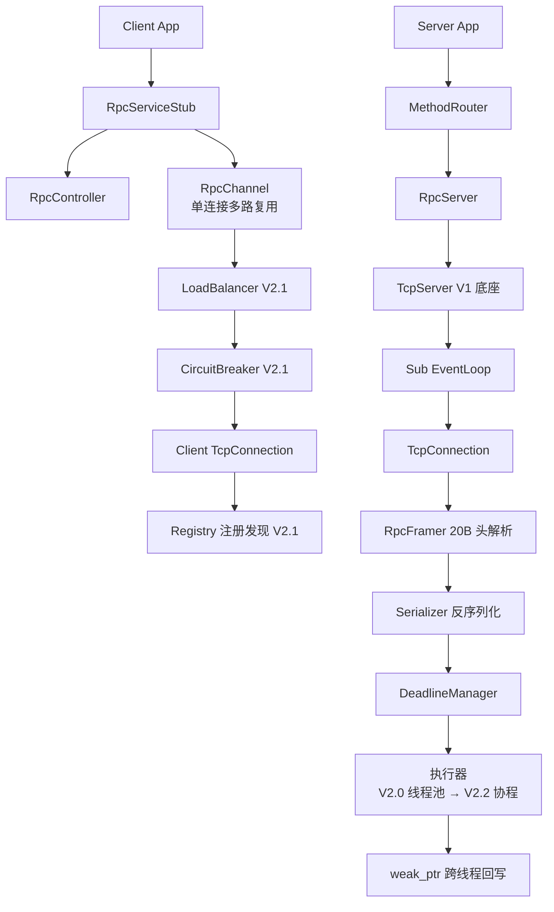

# MyRPCProject V2 设计方案草案

更新时间：2026-08-12

本草案基于两份输入：`docs/competitive-analysis.md`（竞品分析报告）与 V1 实际源码。V2 全部能力**纯自研、零第三方依赖**（决策项），按 V2.0 / V2.1 / V2.2 三个阶段推进，每阶段可独立交付、验收。

## 0. V1 现状与 V2 总体路线

### 0.1 V1 实际能力（对照源码）

| 已有能力 | 对应代码 | 备注 |
| --- | --- | --- |
| Main-Sub Reactor | `EventLoop` / `ThreadPool`（sub loop） | 连接 I/O 走 sub loop |
| epoll ET / poll | `EpollPoller` / `PollPoller` | Linux / macOS 分支 |
| Length-Prefix 分帧 | `Codec`：4B 长度 + body，max 64MB | 半包/粘包正确 |
| 非阻塞写 | `TcpConnection::sendInLoop` + `outputBuffer` | 无高水位保护 |
| 业务异步执行 | `AIService` worker 线程池（经主 loop 投递） | 与 I/O 线程解耦 |
| 跨线程安全回写 | `weak_ptr.lock()` → `queueInLoop` | 连接关闭后不再写 |
| 空闲清理 / 定时器 / 优雅退出 | `TcpServer::checkIdleConnections`、`EventLoop` 定时器、信号退出 | 空闲超时 30s |
| Prometheus 风格指标文本 | `Metrics::renderPrometheusAndRotate` | 无 histogram；`pendingTaskSize()` 恒返回 0 |
| 内存池 | `MemoryPool<T>` / `BufferMemoryPool` | mutex 保护，非线程本地 |

V1 的 `Message` 只有 `body`，没有 `request_id` / `method` / `status` / 超时 / 客户端 / 治理 —— 这是 V2.0 要补的缺口。

### 0.2 V2 三阶段路线

```text
V2.0 协议与 RPC 语义闭环      从「分帧原型」→「可用 RPC」
  ├─ 20B 定长协议头（request_id / method_id / status / deadline）
  ├─ 自研 tag-based 二进制序列化
  ├─ 服务端 Router + 请求级超时 + 迟到响应丢弃
  ├─ C++ 客户端 stub（单连接多路复用 + 同步/异步调用）
  └─ 心跳保活与空闲清理整合

V2.1 服务治理                防雪崩 + 集群化基础
  ├─ 注册中心抽象 + 本地实现（ephemeral + watch 语义）
  ├─ 负载均衡（p2c / 加权轮询 / 一致性哈希）
  ├─ 熔断（EMA 滑动窗口 + 半开）+ 服务端 max_concurrency 限流
  ├─ 重试（透明重试判定 + jitter 退避 + 令牌桶 + hedging）
  └─ 两阶段优雅关闭（Stop/Join）

V2.2 性能与可观测            极限指标 + 可排障
  ├─ M:N 协程调度器（bthread 简化版）替代业务线程池
  ├─ 批量读写 / 缓冲链 / 高水位背压
  ├─ trace_id / span_id 链路追踪（框架自动产生 + 显式传递）
  ├─ 真实队列深度 + histogram 指标 + /metrics 自省页
  └─ 优雅关闭增强（在途计数 + 超时强退）
```

### 0.3 V2 总体架构



各阶段复用 V1 底座（`EventLoop` / `Poller` / `Channel` / `Buffer` / `TcpConnection` / `TcpServer`），不做推倒重来。

---

## 1. V2.0 —— 协议与 RPC 语义闭环

### 1.1 目标

- 协议从纯分帧升级为带 RPC 语义的完整头部：请求/响应/oneway/心跳区分、`request_id` 关联、方法路由、状态码。
- 自研二进制序列化，带字段演进兼容规则。
- 服务端：方法路由、请求级超时（deadline）、迟到响应丢弃、状态码体系。
- 客户端：C++ stub，单连接多路复用（乱序响应按 `request_id` 匹配），同步/异步两套 API，连接状态机 + 心跳。
- 保持 V1 已有的跨线程安全回写与 I/O 模型不变。

### 1.2 协议设计

#### 1.2.1 定长协议头（20 字节，网络字节序）

借鉴 tRPC 16B 头 / SOFA Bolt 22B 头 / bRPC 12B 头（竞品报告 §2、§6-#1）。

```text
byte  0-1    magic        u16   "MP"（0x4D50）快速协议识别，前 2 字节即可判协议
byte  2      version      u8    协议主版本 = 1；升级时向后兼容字段追加
byte  3      flags        u8    bit0=body 压缩  bit1=附件存在  bit2=trace 存在
byte  4      msg_type     u8    0=请求 1=响应 2=oneway 3=心跳 4=心跳响应
byte  5-6    status       u16   请求时为 0；响应时承载错误码（见 1.2.3）
byte  7-10   request_id   u32   调用方唯一、响应原样带回；多路复用关联键
byte 11-14   method_id    u32   FNV-1a32(service.method) 快速路由
byte 15-18   body_len     u32   序列化 body 长度（不含 20B 头）
byte 19     reserved     u8     扩展预留（未来压缩算法号 / 协议演进）
```

长度域语义写死：`body_len = 序列化后的 body 字节数，不含头`（规避 Netty lengthAdjustment 口径混淆坑，竞品报告 §5）。

#### 1.2.2 序列化：自研 tag-based 二进制格式

不引 protobuf，但借鉴其 tag 思想与 Thrift Compact 的紧凑字段头（竞品报告 §6-#11、§3.4）。目标：动态类型（免 IDL/代码生成）、未知字段可跳过、字段演进兼容。

- **wire type**（低 3 位 tag）：`0=varint 1=64bit 2=length-delimited 3=32bit`（protobuf 兼容族）。
- 字段编码：`tag = (field_number << 3) | wire_type`，varint 编码；`int32/int64/uint64/bool/enum` 走 varint（负整数 zigzag）；`string/bytes/嵌套 message` 走 length-delimited。
- **顶层 `Value` 类型**：`null / bool / int64 / uint64 / double / string / bytes / array / map / struct`，作为通用消息体（服务方法参数与返回值都编码为 struct，字段号从 1 开始）。
- **演进纪律**（写进 `Serializer` 文档注释）：字段号一旦发布不可改、不可复用（删除要 reserve）；只允许追加新字段号；类型变更视为破坏性变更；解码时未知字段按 wire_type 跳过（前向兼容）；未设置字段默认全零（借鉴 Cap'n Proto「默认值 = 全零」）。
- **双视图排障**：提供 `toJson(const Value&)` 只读调试输出（借鉴 brpc json2pb 双协议暴露，竞品报告 §3.2、§5）。

#### 1.2.3 状态码体系（status）

借鉴 bRPC error_code / gRPC grpc-status / SOFA respstatus（竞品报告 §3.1、§3.2、§3.5）。V2.0 只定义服务端应答所需最小集，V2.1 追加治理相关码。

```text
0   OK
1   INVALID_ARGUMENT
2   METHOD_NOT_FOUND        （method_id 无对应 handler）
3   SERIALIZATION_ERROR
4   INTERNAL_ERROR
5   DEADLINE_EXCEEDED
6   REQUEST_TOO_LARGE       （超 max_body_size）
7   UNKNOWN                  （结果不确定，可能已执行 —— Birrell 失败模型，竞品报告 §4.1）
8   SHUTTING_DOWN           （V2.1 优雅关闭，等价 bRPC ELOGOFF）
9   CIRCUIT_OPEN            （V2.1 熔断）
10  CONCURRENCY_LIMITED     （V2.1 服务端限流）
```

### 1.3 服务端改造

- `TcpConnection` 的 message callback 从 `Message` 升级为 `RpcMessage`（已解析的头 + body 字节），由新的 `RpcFramer` 负责拆帧（替换 `Codec::decode` 的 4B 前缀解析）。
- `RpcServer` 持有 `method_id → Handler` 路由表（`Router`）；请求先做 deadline 判定（到达时已过期 → 直接回 `DEADLINE_EXCEEDED`，借鉴 SOFA FailFast 与服务端排队超时丢弃，竞品报告 §3.5、§6-#3），再反序列化、路由、投递执行。
- 执行器：V2.0 沿用 V1 `AIService` 式业务线程池（含 `max_concurrency` 信号量，见 2.7），V2.2 替换为协程。
- **迟到响应丢弃**：响应回写时 `weak_ptr.lock()` 失败即丢弃（V1 已有）；客户端侧超时后，迟到的响应由客户端按 `request_id` 查不到 pending 记录直接丢弃（见 1.4）。
- 心跳：`msg_type=3` 心跳请求 → 服务端回 `msg_type=4` 心跳响应，不计入业务统计。

### 1.4 客户端：单连接多路复用

借鉴 bRPC correlation_id + O(1) 响应路由、Netpoll mux（竞品报告 §3.2、§3.5、§6-#2）。

- `RpcChannel`：面向一个服务端地址的虚拟通道，底层持有 `ClientTcpConnection`（复用 V1 `TcpConnection` 的 EventLoop 机制）。
- **pending 表**：`request_id → PendingCall`（indexed vector + 空闲槽复用，O(1) 路由；超量退化为 unordered_map）。响应到达按 `request_id` 定位回调；查不到 → 迟到响应，丢弃并计数。
- `request_id` 分配：每连接单调递增 u32，回绕跳过仍 pending 的 id。
- **连接状态机**：`IDLE / CONNECTING / READY / TRANSIENT_FAILURE / CLOSED`（借鉴 gRPC channel 五态，竞品报告 §3.1），重连指数退避，无调用活动时退回 IDLE 回收。
- **API**：同步 `call()`（内部 = 异步 + deadline 等待）与异步 `callAsync(controller, method, request, response, done)`；`RpcController` 承载每次调用的 method / deadline / status / error_text / cancel。
- **超时语义**：单一 deadline，到点即结束且**不重试**；区分 `timeout_ms` 与 `connect_timeout_ms`（强制 `connect_timeout < timeout`，规避熔断永不触发坑，竞品报告 §7-#1）。

### 1.5 心跳与空闲清理整合（V1 已有机制改造）

- 应用层心跳：客户端空闲 N 秒发心跳（默认 5s），`心跳周期 < 空闲清理阈值(30s)`（规避两者冲突，竞品报告 §7-#15）。
- 空闲判定只认业务流量（V1 `TcpConnection::touchActivity` 需区分：心跳触达不刷新业务空闲时间戳，或心跳连接单独计数）。
- 服务端连续未收到任何报文超过 `idle_timeout * 2` 判死并清理（保留 V1 定时清理通道）。

### 1.6 V2.0 文件清单

**改造（4 个）**

```text
include/Message.h        Message 增加头字段（request_id/msg_type/method_id/status...）或新增 RpcMessage
include/Codec.h|.cpp     拆帧逻辑升级为 RpcFramer（20B 头解析，保留半包/粘包与 max_body_size 语义）
src/TcpConnection.cpp    message callback 类型切换；touchActivity 区分心跳
src/main.cpp             示例改为注册真实 service 方法
```

**新增（9 个）**

```text
include/Protocol.h       RpcHeader 结构 + 常量 + 状态码枚举
include/Serializer.h     Value 类型 + tag-based 编解码 + toJson 调试输出
src/Serializer.cpp
include/Router.h         method_id → handler 注册与路由
include/RpcServer.h      服务端入口（TcpServer 封装：deadline/心跳/路由）
src/RpcServer.cpp
include/RpcChannel.h     客户端虚拟通道 + pending 表 + 连接状态机
src/RpcChannel.cpp
include/RpcController.h  单次调用上下文（method/deadline/status/cancel）
include/RpcClient.h      客户端入口（创建 RpcChannel、连接管理）
src/RpcClient.cpp
include/Heartbeat.h      心跳发送/判定
src/Heartbeat.cpp
```

### 1.7 关键接口草图

```cpp
// Protocol.h
struct RpcHeader {
    uint16_t magic{0x4D50};
    uint8_t  version{1};
    uint8_t  flags{0};
    uint8_t  msgType{0};        // kRequest / kResponse / kOneway / kHeartbeat / kHeartbeatAck
    uint16_t status{0};
    uint32_t requestId{0};
    uint32_t methodId{0};
    uint32_t bodyLen{0};
    uint8_t  reserved{0};
};
enum Status : uint16_t { OK=0, INVALID_ARGUMENT=1, METHOD_NOT_FOUND=2, /* ... */ UNKNOWN=7 };

// Serializer.h —— 动态 Value 类型（自研零依赖）
struct Value;   // variant: null/bool/int64/uint64/double/string/bytes/array/map/struct
class Serializer {
public:
    static void write(Writer& out, const Value& v);
    static bool read(Reader& in, Value* out, Status* err);  // 未知字段跳过
    static std::string toJson(const Value& v);              // 只读调试视图
};

// RpcServer.h
class RpcServer {
public:
    using Handler = std::function<void(const RpcContext&, const Value& request, Value* response)>;
    void registerMethod(std::string service, std::string method, Handler h);  // 内部算 method_id
    void start(int threadNum); void stop();
private:
    std::unique_ptr<TcpServer> tcpServer_;
    Router router_;
};

// RpcController.h
class RpcController {
public:
    void setDeadline(std::chrono::steady_clock::time_point d);
    void setMethod(std::string service, std::string method);
    Status status() const; const std::string& errorText() const;
    bool cancelled() const; void startCancel();
};

// RpcChannel.h
class RpcChannel {
public:
    void callAsync(const RpcController& ctrl, const Value& request, Value* response,
                   std::function<void()> done);          // response 生命周期由 done 内释放（bRPC 纪律）
    bool call(const RpcController& ctrl, const Value& request, Value* response); // 同步 = 异步 + 等待
    void setConnectTimeoutMs(int ms);
private:
    struct PendingCall { uint32_t id; RpcController ctrl; Value* resp; std::function<void()> done; };
    std::vector<PendingCall> pending_;   // 空闲槽复用，O(1) 路由
    ClientTcpConnection conn_;
};
```

### 1.8 V2.0 验收方式

- 单连接并发请求乱序响应正确配对（e2e client 升级：并发 N 请求，各带不同 method/参数，逐一核对 request_id）。
- 超时验证：handler sleep 超过 deadline → 客户端 `DEADLINE_EXCEEDED`，迟到响应被丢弃且连接仍可复用。
- 粘包/半包回归：V1 `Codec` 测试等价用例在 `RpcFramer` 上重跑。
- 心跳：空闲连接不被清理，对端消失后 2 倍心跳周期内判死。
- 现有 Docker Linux epoll 验收脚本 `scripts/acceptance.sh` 继续通过。

### 1.9 V2.0 借鉴出处

协议头（§6-#1/#20）、多路复用（§6-#2）、deadline 剩余时间与 FailFast（§6-#3）、三分结果码（§6-#4）、序列化演进纪律（§6-#11）、协议 ≠ 序列化与长度域口径（§5）、心跳/空闲冲突（§7-#15）。

---

## 2. V2.1 —— 服务治理

### 2.1 目标

- 多实例支持：注册中心抽象 + 本地实现；客户端服务发现与订阅。
- 负载均衡：p2c / 加权轮询 / 一致性哈希。
- 防雪崩：客户端节点级熔断 + 服务端 `max_concurrency` 限流 + 保守重试（含 hedging）。
- 两阶段优雅关闭（`Stop/Join` + 在途计数 + 超时强退）。

### 2.2 注册中心抽象 + 本地实现

借鉴 ZooKeeper 模型（ephemeral + 一次性 watch + 会话超时判死 + 版本 CAS，竞品报告 §4.4、§6-#9）与 Birrell binding（接口 + 实例 id，崩溃后绑定失效，§4.1）。

```cpp
// Registry.h —— 抽象接口，V2.1 提供 LocalRegistry；预留 etcd/zk 适配位
struct Instance { std::string service; std::string addr; uint64_t instanceId; /* 重启递增 */ };
class Registry {
public:
    virtual void registerService(const Instance&, LeaseOpts) = 0;   // 租约心跳
    virtual void unregister(const std::string& service, uint64_t instanceId) = 0;
    virtual std::vector<Instance> lookup(const std::string& service) = 0;
    virtual void watch(const std::string& service, WatchCallback cb) = 0;  // 一次性语义
    virtual void renewLease(const std::string& service, uint64_t instanceId) = 0;
};
```

- `LocalRegistry`：进程内 map + 租约计时器 + 版本号 CAS（并发下线/重注册不覆盖）；用于单机多进程/多线程演示与单测。
- **watch 一次性**：客户端「注册 → 事件 → 重新注册」，连接丢失事件触发全量刷新（规避 watch 丢失，§7-#8）。
- 故障判定基于租约超时，不依赖 TCP 断开事件（§4.4）。
- 服务端上报：`renewLease` 由 Heartbeat 计时器驱动；服务端优雅关闭时先 `unregister` 再摘流量。

### 2.3 负载均衡

借鉴 bRPC LB 策略集（§3.2、§6-#10）。接口 `LoadBalancer::pick(Key, const std::vector<Instance>&, const BreakerState&) -> size_t`。

- **p2c**：随机采样两台，按 `延迟EMA × (inflight+1) / 权重` 取小者；O(1)、对集群规模无关（默认）。
- **加权轮询**（wrr）：平滑加权，散开。
- **一致性哈希**（c_murmurhash 式）：cache 类方法用，可配虚拟节点 160。
- 熔断节点从候选剔除（与 2.4 联动）。

### 2.4 熔断（节点级）

借鉴 bRPC EMA 错误代价 + 长短双窗口 + 隔离期翻倍 + 半开探测（§3.2、§6-#7）。

```cpp
// CircuitBreaker.h
class CircuitBreaker {
public:
    void onSuccess(); void onError(int status, int64_t latencyMs);
    bool allowRequest() const;      // CLOSED → 放行；OPEN → 拒绝；HALF_OPEN → 单探测请求
private:
    // 滑动窗口（环形桶）：错误率 / 慢调用比例；minRequestAmount 防低流量误熔断（§7-#11）
    // 错误代价 = EMA 平滑 latency；熔断隔离期 100ms 起指数翻倍，上限 30s
};
```

- 指标：10s 窗口错误率 > 阈值 且 请求量 > minRequestAmount → OPEN。
- 恢复：隔离期后放一个探测请求，成功回 CLOSED，失败重新 OPEN。
- **集群恢复期限流**：所有节点不可用时，接受概率 = `q / min_working_instances`（防恢复死循环，§6-#8）。

### 2.5 重试

借鉴 gRPC A6 透明重试判定 + 令牌桶、bRPC backup request、AWS jitter（§3.1、§3.2、§5、§6-#5/#6）。

- **默认只在连接错误时重试**；次数上限 3；jitter 退避 `random × min(上限, base × 2^n)`。
- **透明重试判定**：请求未离开发送缓冲（未 commit）或对端以「未接受该 request_id」方式断开 → 无条件重试，不计次数。
- **幂等约束**：`RpcController` 设 `idempotent` 标记；非幂等方法禁止自动重试（Birrell 三分结果码 + 幂等前提，§4.1、§6-#4）。
- **hedging**：可选，`hedge_after_p99` 内未返回则向另一节点发备份，取先到者；仅幂等方法可用；受重试令牌桶约束。
- 令牌桶（`RetryBudget`）：maxTokens=10，失败 -1 / 成功按比例 +，耗尽即快速失败（防重试风暴，§3.1）。

### 2.6 服务端限流：max_concurrency

借鉴 brpc/Sentinel 限并发优于限 QPS + 超限快速失败（§5、§6-#12）。

```cpp
// ConcurrencyLimiter.h —— 信号量；阈值 = 极限QPS × 低负载延时（Little's law）
class ConcurrencyLimiter {
public:
    bool tryAcquire();   // 超限返回 false → 服务端回 CONCURRENCY_LIMITED，让客户端去重试别的节点，不排队
    void release();
};
```

### 2.7 两阶段优雅关闭

借鉴 bRPC Stop/Join + Dubbo/K8s（§5、§6-#14、§7-#13）。

- `RpcServer::stop()`：不再 accept；新请求回 `SHUTTING_DOWN`（明确错误码，不是裸 close）；`unregister` 摘流量。
- 等待在途请求计数归零（显式 `inflight counter`，不依赖引用计数自然归零），超时（默认 10s）强退。
- 客户端收到 `SHUTTING_DOWN` → 重试其他节点。

### 2.8 V2.1 文件清单

**新增（6 个）**

```text
include/Registry.h|src/Registry.cpp        注册中心抽象 + LocalRegistry
include/NamingService.h|src/NamingService.cpp  客户端发现：拉取 + 缓存 + watch 重注册
include/LoadBalancer.h|src/LoadBalancer.cpp    p2c / wrr / consistent-hash
include/CircuitBreaker.h|src/CircuitBreaker.cpp  EMA 滑动窗口 + 半开 + 恢复期限流
include/RetryPolicy.h|src/RetryPolicy.cpp     透明重试判定 + jitter + 令牌桶 + hedging
include/ConcurrencyLimiter.h                  max_concurrency 信号量
```

**改造（3 个）**

```text
src/RpcServer.cpp       优雅关闭（stop/join/在途计数）+ SHUTTING_DOWN + CONCURRENCY_LIMITED
src/RpcClient.cpp       发现订阅 + LB 选择 + 熔断/重试挂载
include/RpcController.h 增加 idempotent / hedge 标记
```

### 2.9 V2.1 验收方式

- 双实例 demo：注册中心登记 2 个实例，LB 流量分布正确；kill 一个 → watch 事件 → 流量收敛到存活实例，无错误风暴。
- 熔断单测：注入错误率 → OPEN → HALF_OPEN → CLOSED 状态迁移正确；低流量不误熔断。
- 重试单测：连接错误重试、非幂等不重试、令牌桶耗尽快速失败、hedging 双发取先到。
- 优雅关闭：stop 后新请求得 SHUTTING_DOWN，在途请求完成，超时强退；e2e 无连接错误。

### 2.10 V2.1 借鉴出处

注册中心（§6-#9、§4.4）、LB 与容错族（§6-#10）、EMA 熔断（§6-#7）、恢复期限流（§6-#8）、透明重试与令牌桶（§6-#5）、hedging（§6-#6）、限并发（§6-#12）、优雅关闭（§6-#14）、退不掉坑（§7-#13）、roundrobin 慢机器坑（§7-#7）。

---

## 3. V2.2 —— 性能与可观测

### 3.1 目标

- M:N 协程调度器（bthread 简化版）替代业务线程池：请求级超时只阻塞协程、并发度软限、天然按负载伸缩。
- 批量读写、缓冲链、outputBuffer 高水位背压，补 V1 慢消费者缺口。
- trace_id / span_id 链路追踪：框架自动产生、显式跨线程传递、整树低采样。
- 真实指标：修复 `pendingTaskSize()` 恒 0、histogram 延时、/metrics 自省页。

### 3.2 M:N 协程调度器（BThread 简化版）

借鉴 bRPC bthread（work-stealing + butex，§3.2、§6-#17），但**明确 NonGoal**：不 hook 阻塞系统调用、不做 pthread 完全兼容 —— 只需覆盖「业务 handler 内的睡眠/等待可被调度」这一个需求。

```cpp
// Scheduler.h
class Scheduler {
public:
    void start(int workers);
    void stop();
    // 在某个 worker 上启动协程执行 fn；fn 内调用 co_sleep / co_yield 让出
    void spawn(std::function<void()> fn);
private:
    std::vector<Worker*> workers_;   // N pthread，本地 runqueue + work stealing
    std::atomic<uint64_t> nextCoId_; // 协程栈 guard page + 版本号防 ABA
};
```

- 每个请求一个协程；`co_sleep(ms)` 让出 worker（deadline 等待不占线程）。
- 线程数是软限：worker 全阻塞时不新增 worker，靠 `max_concurrency` 兜底（竞品报告 §3.2 教训）。
- 替换点：V1 `AIService` worker 线程池与 `RpcServer` 执行器；`ThreadPool::submit`（连接分配）保持不变。

### 3.3 批量读写与缓冲链

- 读：ET 循环读到 EAGAIN，一次事件拆完所有完整帧后批量投递执行器（减少投递次数，§5、§6-#18）。
- 写：多个响应合并为一次 `writev`（减少 syscall）；`outputBuffer` 升级为链式缓冲（借鉴 Netpoll Nocopy LinkBuffer，§3.5、§6-#18）。
- 大 body（> 阈值，如 1MB）走附件通道绕过序列化（§3.2 附件机制）；`max_body_size` 拒收超限并断连（V1 Codec 已有，保留）。
- 内存池：对高频小对象（连接、请求上下文、缓冲块）做 thread-local 等长池 + 版本号（bRPC ObjectPool 思路，§5），不滥用（§7-#6）。

### 3.4 outputBuffer 高水位背压

借鉴 Netty high/low water mark + brpc KeepWrite（§3.5、§6-#13、§7-#12）。

- 每连接写缓冲设高水位（如 4MB）/ 低水位（2MB）：超高水位 → 暂停向该连接投递新响应 + 确保 EPOLLOUT 挂上；降到低水位 → 恢复投递。
- 持续写不动（水位长期不降，如 30s）→ 主动关闭并回调错误（慢消费者断开，内存无界增长兜底）。
- 写路径：`sendInLoop` 第一线程直写，写不完由后台续写线程（KeepWrite 线程）继续（V1 目前是 EPOLLOUT 驱动，保留即可，可加合并写）。

### 3.5 链路追踪

借鉴 Dapper + 美团事故教训（§4.3、§6-#15、§7-#14）。

- `trace_id`（u64）+ `span_id`（u64）+ `parent_span_id` 放入协议头（flags bit2 标记存在）。
- **框架自动产生**：`RpcServer` / `RpcChannel` 在消息头生成/透传，业务无感知（Dapper 关键教训：结构信息靠框架）。
- **显式传递**：trace 上下文放进任务对象（`RpcContext` / pending call），**不依赖 thread-local**（业务线程池回写时会丢 traceId —— V1 的 weak_ptr 回写路径正是高危点）。
- 整树低采样：默认 1/1024（可配），一个 trace 要么全采要么全不采。
- span 记录：方法名、父子 span_id、耗时、status；错误日志带 trace_id（排障基本盘）。

### 3.6 真实指标与 /metrics

- 修复 `ThreadPool::pendingTaskSize()`：`submit` 时对 pending functors 计数（或执行器维护真实队列深度）。
- histogram 延时桶（本地定长桶数组 + 周期汇总，借鉴 Prometheus histogram 桶聚合优于 summary，§5、§6-#16）。
- 指标最小集：qps、延时分布（含 sum/count）、错误码分布、熔断计数、活跃连接、队列深度。
- `/metrics` 自省页：V1 是文本日志，V2.2 提供 HTTP 拉取（最小 HTTP 响应实现，零依赖），Prometheus 可直接 scrape。

### 3.7 V2.2 文件清单

**新增（5 个）**

```text
include/Scheduler.h|src/Scheduler.cpp      M:N 协程调度器（work-stealing + butex 简化）
include/Tracing.h|src/Tracing.cpp          trace/span 生成、透传、采样、日志关联
include/BufferChain.h|src/BufferChain.cpp  链式写缓冲 + 零拷贝拼接
include/Histogram.h|src/Histogram.cpp      定长桶延时分布
include/MetricsServer.h|src/MetricsServer.cpp  /metrics HTTP 自省页
```

**改造（5 个）**

```text
src/TcpConnection.cpp   outputBuffer → BufferChain + 高/低水位 + 慢消费者断开
src/EventLoop.cpp       pending functors 真实计数（或暴露计数接口）
src/AIService.cpp       执行器切换为 Scheduler（或保留接口、实现换底）
src/RpcServer.cpp       执行器挂 Scheduler；trace 上下文注入
src/Metrics.cpp         增加 histogram / 错误码分布 / 队列深度真实值
```

### 3.8 V2.2 验收方式

- 协程正确性：单测 —— 超时/睡眠不占 worker、N 个并发睡眠全部及时完成、work stealing 均衡。
- 背压：慢消费者（不读的客户端）水位升到高水位后投递暂停，持续不降被断开，服务端内存有界。
- trace：e2e 抓一个 trace，span 树完整（client → server → 业务）；异步回写路径 trace_id 不丢。
- 指标：`pendingTaskSize` 为真实值；`/metrics` 返回 histogram 与错误码分布。
- 回归：V2.0 / V2.1 全部验收用例继续通过；Docker Linux epoll acceptance 通过。
- 性能对比（窄口径）：与 V1 同条件（128B body、单机、不访问 DB）跑 `bench.py`，记录 QPS/P99 对比，作为协程/批量收益的度量，不做夸张宣传。

### 3.9 V2.2 借鉴出处

M:N 协程（§6-#17）、批量/ET/内存池（§6-#18）、零拷贝取舍（§6-#19）、背压（§6-#13、§7-#12）、trace（§6-#15、§7-#14）、histogram（§6-#16）、退不掉（§7-#13）。

---

## 4. 依赖关系与里程碑

```text
V2.0（协议与语义闭环）   ── 地基，V2.1/V2.2 全部依赖
   ↓
V2.1（服务治理）         ── 依赖 V2.0 协议（status 码、method 路由、deadline）
   ↓
V2.2（性能与可观测）     ── 依赖 V2.0（trace 进协议头）；部分独立（背压、指标）

里程碑建议：
  M1 = V2.0 完成 + e2e/超时/乱序用例通过
  M2 = V2.1 完成 + 双实例故障演练通过
  M3 = V2.2 完成 + 全量回归 + 性能对比记录
```

## 5. 关键取舍与风险

| 取舍 | 理由 | 风险与缓解 |
| --- | --- | --- |
| 纯自研序列化，不引 protobuf | 用户决策；面试展示力强、无构建依赖 | 兼容性/工具链自维护 → 演进纪律写死 + toJson 双视图排障 |
| V2.0 先单服务直连，V2.1 才做注册发现 | 协议语义闭环是地基，治理是叠加 | 客户端地址管理预留接口位，避免返工 |
| 20B 定长头 + 动态 Value，无 IDL 代码生成 | 免 protoc 依赖、实现最简 | 类型安全弱 → 用 status 码 + 文档约束 |
| M:N 协程只覆盖业务等待，不 hook 系统调用 | bRPC NonGoal 同款，控制实现面 | worker 全阻塞兜底靠 max_concurrency |
| 附件通道只在 >1MB 时启用 | 小包走附件无收益（Netpoll 教训） | 阈值可配 |
| 心跳/空闲冲突、迟到响应、重试放大等坑 | 见竞品报告 §7 全表 | 每项都有对应规避设计（§1.5、§1.4、§2.5） |

## 6. 与竞品报告的对应

- 竞品报告 §6「值得借鉴清单」20 条：V2.0 覆盖 #1-#4/#11/#20；V2.1 覆盖 #5-#10/#12/#14；V2.2 覆盖 #13/#15-#19。
- 竞品报告 §7「需要规避的坑」20 条：V2 草案均有对应规避设计（括号标注）。
- 竞品报告 §8 总体建议的三条主线即本草案三阶段。
